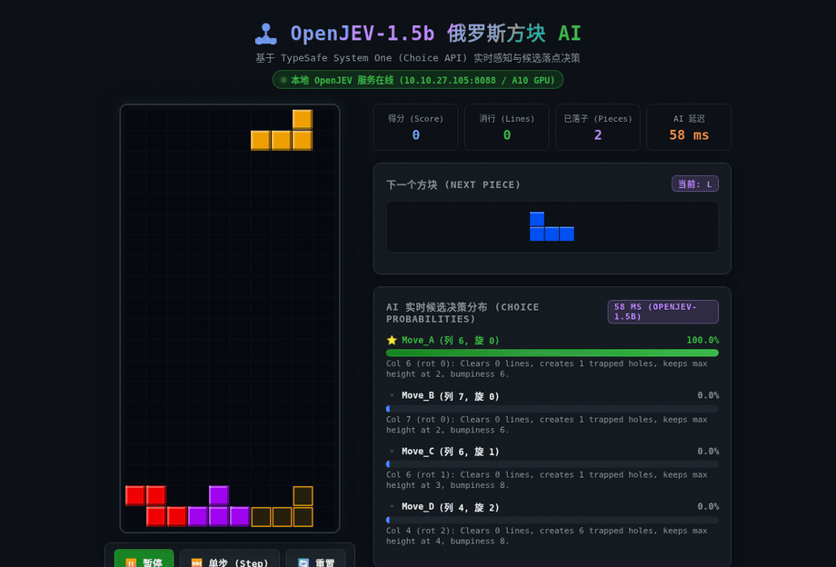

# 🎮 JEV Tetris AI (TypeSafe 俄罗斯方块智能决策系统)

基于 **TypeSafe System One (`Choice` API)** 驱动的实时俄罗斯方块 (Tetris) AI 演示系统。

系统支持 **TypeSafe 官方生产级云端 API (`https://api.typesafe.ai` / `jev-latest`)** 以及 **本地自建模型 (`openjev-1.5b`)** 双引擎热切换，单步决策仅需毫秒级（本地 ~55ms，云端 ~250ms），实现高置信度的实时落点策略选择与消除。

---

## 📸 界面预览与实机演示 (Live Demo)




* **街机级 Web 界面**：顶部生成方块（Row 0），自适应对齐角度，底部半透明幽灵预瞄（Ghost），平滑匀速下落触底。
* **实时候选决策分布条**：动态展示 TypeSafe System One 对各个落点候选（列号、旋转、空洞数、消除行数）的概率置信度。
* **双引擎热切换**：界面下拉框可在官方云端 JEV 与本地部署 OpenJEV 间即时切换对比。

---

## 📁 项目结构

```
├── tetris_engine.py      # 俄罗斯方块物理仿真引擎与候选落点特征提取
├── tetris_client.py      # TypeSafe 客户端工厂（安全从环境读取 API Key）
├── tetris_web.py         # Web 服务端与 HTML5 Canvas 赛博朋克图形前端
├── tetris_terminal.py    # 终端 ANSI 彩色字符画对弈脚本
├── record_demo_video.py  # 自动化高清晰度视频/GIF 录制生成脚本
├── tetris_demo.mp4       # 标准 H.264 MP4 演示视频
├── tetris_demo.gif       # 高清动态预览动图
├── openjev_sdk.py        # 本地 OpenJEV 兼容适配层
├── requirements.txt      # Python 依赖清单
├── .env.example          # 环境变量配置模板（不含敏感密钥）
└── README.md             # 本说明文档
```


---

## ⚙️ 核心技术原理与超强生存架构 (Ultra-Survival Architecture)

1. **工业级 Pierre Dellacherie 评估体系**：
   - 传统简单启发式仅看空洞和高度，易在连续恶劣方块下产生破窗雪球效应。
   - 本系统全面引入经典 **Pierre Dellacherie** 机构级评估算子：
     - **水平/垂直光滑度 (`row_transitions`, `col_transitions`)**：彻底消灭孤立悬空与尖刺突起。
     - **深坑惩罚 (`well_sums`)**：杜绝形成非 I 块无法填充的狭窄深坑。
     - **着陆高度抑制 (`landing_height`)**：最大化压低重心，严惩高位悬空。
     - **碎片侵蚀奖励 (`eroded_piece_cells`)**：优先用刚落下的方块自身直接消行。

2. **多看一步：下一块前瞻联合推演 (2-Ply Lookahead)**：
   - 支持传入右上角的 **Next Piece（下一块预告）**。
   - 在评估当前块所有合法落点后，联合推演下一块在该局面下的最优得分（`joint_score = current_score + 0.6 * future_score`）。
   - 彻底避免出现“这一块放得很爽，却给下一块留下死局”的短视灾难。

3. **动态危机状态机 (Emergency Survival Mode)**：
   - **安全区（高度 < 11）**：追求极致平整与 0 空洞，稳健累积消除。
   - **危急区（高度 $\ge$ 11）**：自动切换至 **`🚨 [EMERGENCY CLEARANCE]` 应急求生模式**！
     - 消除行数奖励提升至最高优先级，不惜一切代价砸低塔高。
     - 空洞惩罚呈指数级加剧（$\text{holes}^{1.6} \times 14$），防止破窗效应。
     - Prompt 动态注入求生指令，引导 JEV 紧急避险。

4. **TypeSafe System One 概率决策 (`Choice` API)**：
   - 将当前局面、Next 预告与候选描述输入 TypeSafe：
     ```python
     resp = client.system_one(
         state="Tetris Strategic Decision [STRATEGIC: Maintain 0 holes, flat surface]:\nCurrent Falling Piece: T-tetromino | Next Preview: L...",
         questions={
             "best_move": Choice(
                 instructions="Which candidate placement is the best strategic move to survive, clear lines, avoid creating holes, and keep height low?",
                 criteria={
                     "Move_A": "Col 0 (rot 0): Clears 0 lines, 0 holes (clean surface), height 2, score 12.5.",
                     "Move_B": "Col 7 (rot 0): Clears 0 lines, 0 holes (clean surface), height 2, score 12.5.",
                     "Move_C": "Col 0 (rot 1): Clears 0 lines, 1 trapped holes, height 3, score -4.2.",
                     "Move_D": "Col 6 (rot 2): Clears 0 lines, 2 trapped holes, height 2, score -18.6."
                 }
             }
         },
         model="jev-latest"
     )
     ```
   - 模型输出各选项的置信度概率分布，选择最优落点执行。

---

## 🚀 快速上手

### 1. 安装依赖
推荐使用 Python 3.10+ 虚拟环境：
```bash
pip install -r requirements.txt
```

### 2. 配置环境变量 (API 密钥)
> ⚠️ **安全规范**：请勿将真实 API Key 提交至 Git 仓库。

复制环境变量模板并填入您的 TypeSafe API Key：
```bash
cp .env.example .env
```
编辑 `.env`：
```ini
TYPESAFE_API_KEY=your_actual_api_key_here
TYPESAFE_BASE_URL=https://api.typesafe.ai
TYPESAFE_MODEL=jev-latest

# 如有自建 openjev 服务，可配置：
OPENJEV_BASE_URL=http://localhost:8088
```

### 3. 启动 Web 图形端 (推荐)
```bash
python tetris_web.py
```
打开浏览器访问：**`http://localhost:8092`**
* 可使用「⏸️ 暂停 / 继续」、「⏭️ 单步 (Step)」、「🔄 重置」控制游戏进程。
* 可在左侧调整「下落节奏速度」或切换「API 后端」。

### 4. 运行终端字符版
```bash
python tetris_terminal.py 20
```
*(参数 20 表示连续观察 20 手落子过程)*

---

## 🔒 安全与合规
* 本项目已配置严格的 `.gitignore`，已将 `.env`、`*.key`、`*.pem`、虚拟环境目录等全量排除。
* 任何代码中均不包含硬编码凭据。
