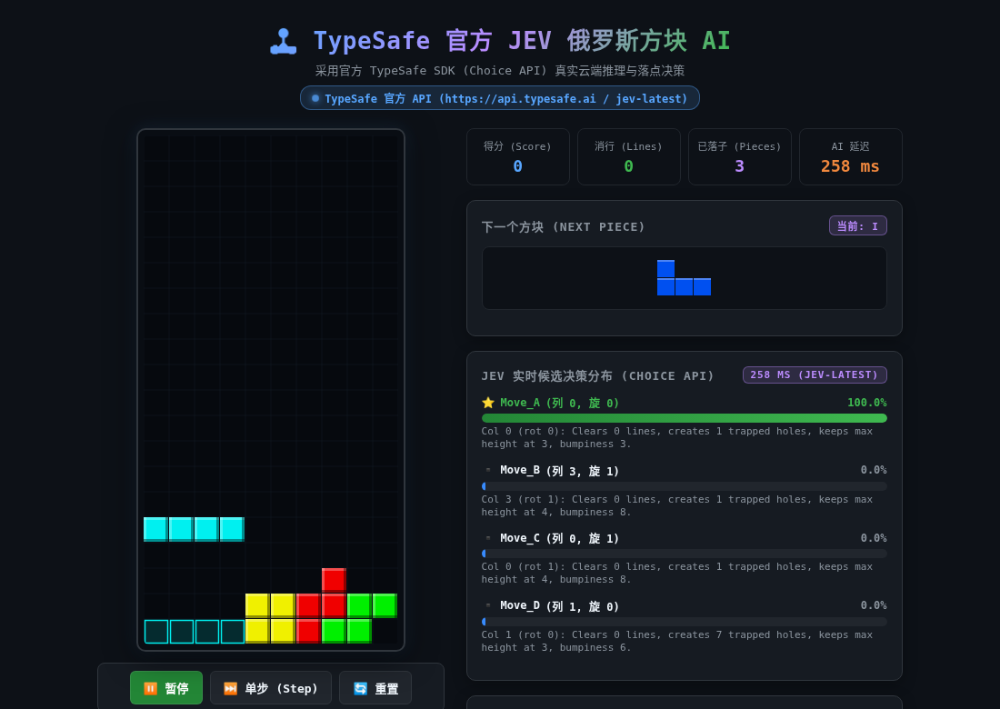

# 🎮 JEV Tetris AI (TypeSafe 俄罗斯方块智能决策系统)

基于 **TypeSafe System One (`Choice` API)** 驱动的实时俄罗斯方块 (Tetris) AI 演示系统。

系统支持 **TypeSafe 官方生产级云端 API (`https://api.typesafe.ai` / `jev-latest`)** 以及 **本地自建模型 (`openjev-1.5b`)** 双引擎热切换，单步决策仅需毫秒级（本地 ~55ms，云端 ~250ms），实现高置信度的实时落点策略选择与消除。

---

## 📸 界面预览



* **街机级 Web 界面**：顶部生成方块（Row 0），自适应对齐角度，底部半透明幽灵预瞄（Ghost），平滑匀速下落触底。
* **实时候选决策分布条**：动态展示 TypeSafe System One 对各个落点候选（列号、旋转、空洞数、消除行数）的概率置信度。
* **双引擎热切换**：界面下拉框可在官方云端 JEV 与本地部署 OpenJEV 间即时切换对比。

---

## 📁 项目结构

```
├── tetris_engine.py      # 俄罗斯方块物理仿真引擎与候选落点特征提取
├── tetris_client.py      # TypeSafe 客户端工厂（安全从环境读取 API Key）
├── tetris_web.py         # Web 服务端与 HTML5 Canvas 赛博朋克图形前端
├── tetris_terminal.py    # 终端 ANSI 彩色字符画对弈脚本
├── openjev_sdk.py        # 本地 OpenJEV 兼容适配层
├── requirements.txt      # Python 依赖清单
├── .env.example          # 环境变量配置模板（不含敏感密钥）
└── README.md             # 本说明文档
```


---

## ⚙️ 核心技术原理

1. **落点候选生成 (Candidate Move Generator)**：
   - 遍历当前方块（I, J, L, O, S, T, Z）的所有合法旋转与平移位置。
   - 快速仿真着陆状态，提取核心战略特征：消除行数 (`lines_cleared`)、不可达空洞 (`holes`)、表面凹凸度 (`bumpiness`)、最大堆叠高度 (`max_height`)。
   - 筛选出最具代表性的 3~4 个策略候选，转化为结构化自然语言描述。

2. **TypeSafe System One 概率决策 (`Choice` API)**：
   - 将当前局面与候选描述输入 TypeSafe：
     ```python
     resp = client.system_one(
         state="Tetris Placement Decision:\nCurrent Falling Piece: T-tetromino...",
         questions={
             "best_move": Choice(
                 instructions="Which candidate placement is the best strategic move to clear lines, avoid creating holes, and keep the board height low?",
                 criteria={
                     "Move_A": "Col 0 (rot 0): Clears 0 lines, creates 0 holes (clean), keeps max height at 2, bumpiness 3.",
                     "Move_B": "Col 7 (rot 0): Clears 0 lines, creates 0 holes (clean), keeps max height at 2, bumpiness 3.",
                     "Move_C": "Col 0 (rot 1): Clears 0 lines, creates 1 trapped holes, keeps max height at 3, bumpiness 3.",
                     "Move_D": "Col 6 (rot 2): Clears 0 lines, creates 2 trapped holes, keeps max height at 2, bumpiness 4."
                 }
             )
         },
         model="jev-latest"
     )
     ```
   - 模型输出各选项的置信度概率分布，选择最优落点执行。

---

## 🚀 快速上手

### 1. 安装依赖
推荐使用 Python 3.10+ 虚拟环境：
```bash
pip install -r requirements.txt
```

### 2. 配置环境变量 (API 密钥)
> ⚠️ **安全规范**：请勿将真实 API Key 提交至 Git 仓库。

复制环境变量模板并填入您的 TypeSafe API Key：
```bash
cp .env.example .env
```
编辑 `.env`：
```ini
TYPESAFE_API_KEY=your_actual_api_key_here
TYPESAFE_BASE_URL=https://api.typesafe.ai
TYPESAFE_MODEL=jev-latest

# 如有自建 openjev 服务，可配置：
OPENJEV_BASE_URL=http://localhost:8088
```

### 3. 启动 Web 图形端 (推荐)
```bash
python tetris_web.py
```
打开浏览器访问：**`http://localhost:8092`**
* 可使用「⏸️ 暂停 / 继续」、「⏭️ 单步 (Step)」、「🔄 重置」控制游戏进程。
* 可在左侧调整「下落节奏速度」或切换「API 后端」。

### 4. 运行终端字符版
```bash
python tetris_terminal.py 20
```
*(参数 20 表示连续观察 20 手落子过程)*

---

## 🔒 安全与合规
* 本项目已配置严格的 `.gitignore`，已将 `.env`、`*.key`、`*.pem`、虚拟环境目录等全量排除。
* 任何代码中均不包含硬编码凭据。
